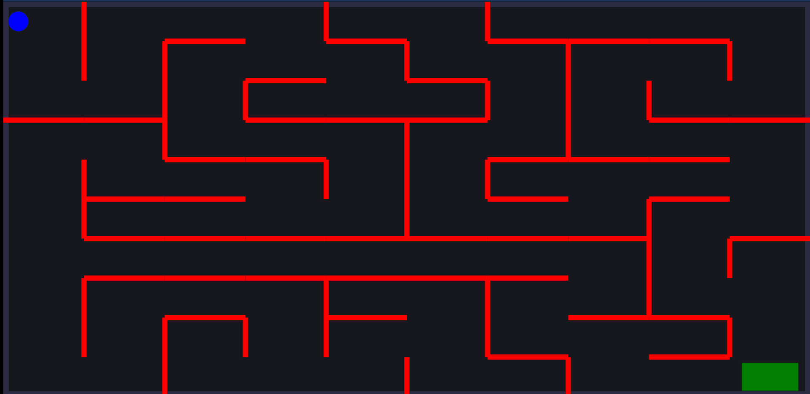

<h1 align="center">Maze Runner</h1>

<h6 align="center"><a href="">Live Demo</a></h6>

**Description**
Maze Runner is a javascript based web application.Here,the maze is going to be different every time you refresh the app because it is created at runtime.The aim here is to take the blue ball from its starting position to the end position that is the green box.The user wins the game when the blue ball makes a collison with the green box.

**Steps done for creating the maze** 
>Firstly,here a grid matrix is taken of dimension m*n ,where m is the number of rows and n is the number of cells .

>Then,we choose a cell at random .

>Then we can now go in four direction from that cell either up ,right ,down ,left . 

>Now we choose any of the given path if exists and mark that cell as visited if not visited untill now and then repeat the step 3 again untill all the cells of the grid are basically visited.

**How to play the game**

You can play this game with the help of the following keys: 

| Key |                 Action                       |
|-----|----------------------------------------------|
|  W  | you can move your ball in upward direction   |
|  D  | you can move your ball in rightward direction|
|  S  | you can move your ball in downward direction |
|  A  | you can move your ball in leftward direction |

**Library Used**

  : is a 2d Physics engine for the web.Here all the walls of the maze and the ball are drawn using the matter.js library.
<a href="https://brm.io/matter-js/">_Documentation Link_</a>

**Lets's see a sample demo**

